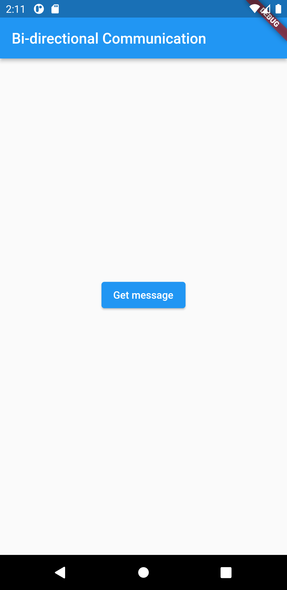
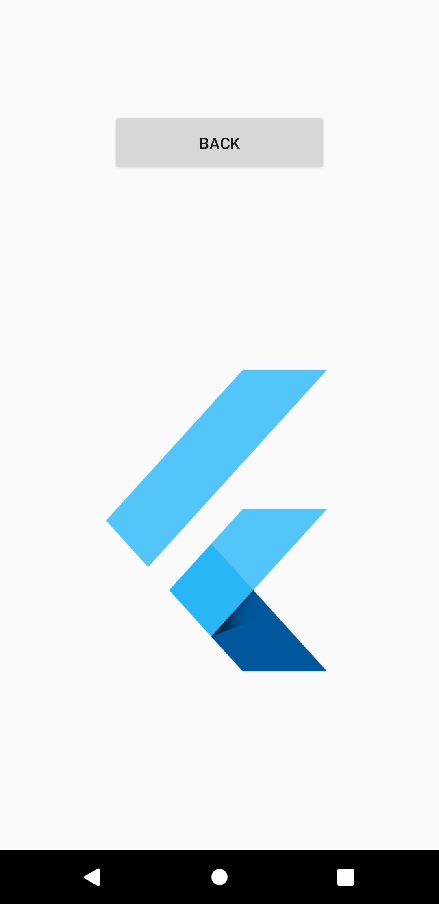
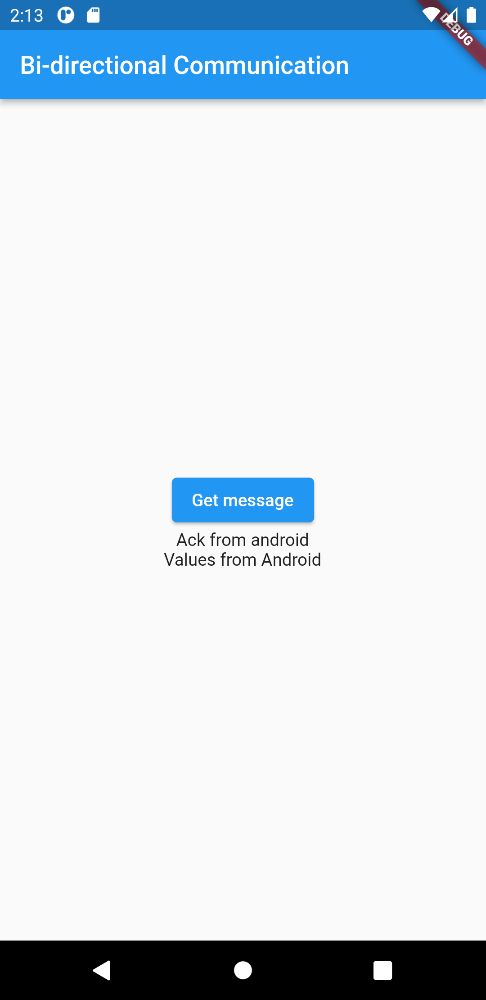

<h2 align="center">
Bi-directional communication 
</h2>

<h3 align="center">
Internal communication between flutter and native code
</h3>

<h4 align="center">
Available for Android and iOS.
</h4>

 

## Demo

<h4 align="center">
Home Screen
</h4>

<h3 align="center">
By clicking "Get message" button to share values and image asset to native android screen.
</h3>

   

 

<h4 align="center">
Android Home Screen
</h4>

<h3 align="center">
Image asset shared from flutter and displayed in native android screen.
</h3>

   

 

<h4 align="center">
Result screen
</h4>

<h3 align="center">
Acknowledgement and values from android native screen is displayed in flutter home screen.
</h3>

   

 